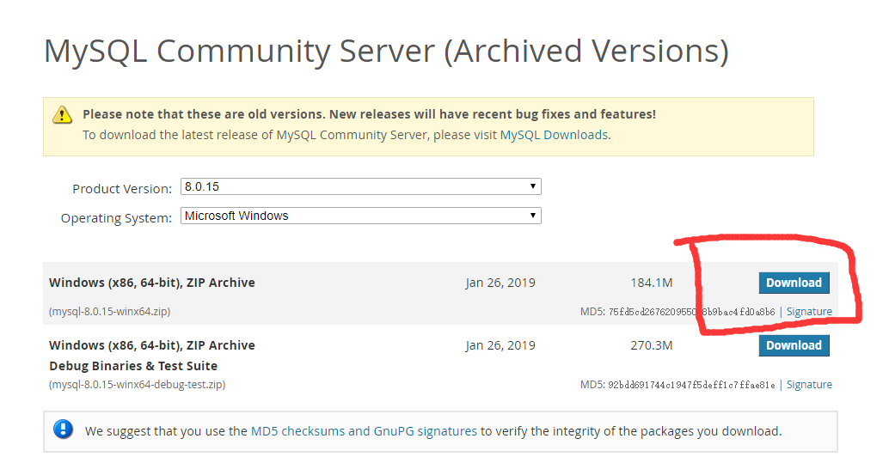
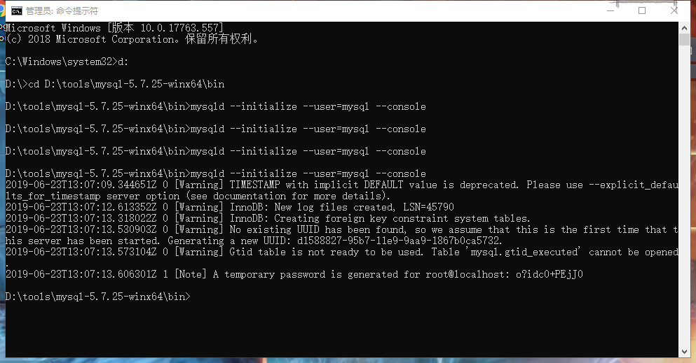
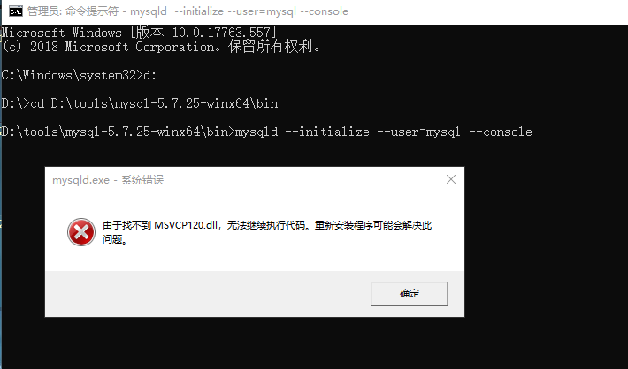

# mysql5.7x 解压版安装

## 下载安装包

打开 [历史地址](https://downloads.mysql.com/archives/community/) ,找到对应的 5.7x 版本下载。



## 安装

### 初始化配置
**win + X** 以管理得权限 PowerShell ,进入解压目录使用初始化命令
```shell
mysqld --initialize --user=mysql --console
```


### 安装服务
使用命令 **mysqld install MySQL**，出现 *Service successfully installed.* 表示安装成功


### 配置信息
进入mysql 的根目录我们可以看到生成了 **data** 目录,在根目录中新建文件**my.ini**
写入配置文件
```config
[mysqld]
character-set-server=utf8
#绑定IPv4和3306端口
port=3306
sql_mode="STRICT_TRANS_TABLES,NO_ENGINE_SUBSTITUTION"
default_storage_engine=innodb
#设置mysql的安装目录
basedir=D:\\tools\\mysql-5.7.25-winx64
#设置mysql数据库的数据的存放目录
datadir=D:\\tools\\mysql-5.7.25-winx64\data
#允许最大连接数
max_connections=200
#免密登录
skip_grant_tables
```
注意要使用 **\\\\** 双斜杠

使用 **net start mysql** 启动服务

## 修改密码
登录帐号 *mysql -uroot -proot* , 因为上面配置了**skip_grant_tables**可以随意输入密码。
修改密码
```sql
update mysql.user set authentication_string=password('you pwd') where user='root' and Host = 'localhost';
```
屏蔽 **skip_grant_tables**,重启服务

## 常见错误
1. 由于找不到 MSVCP120.dll

> 搜索 **微软常用运行库合集64位**  进行安装
